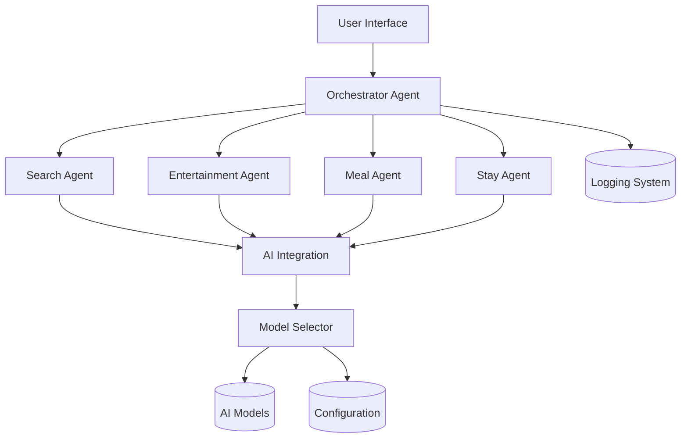
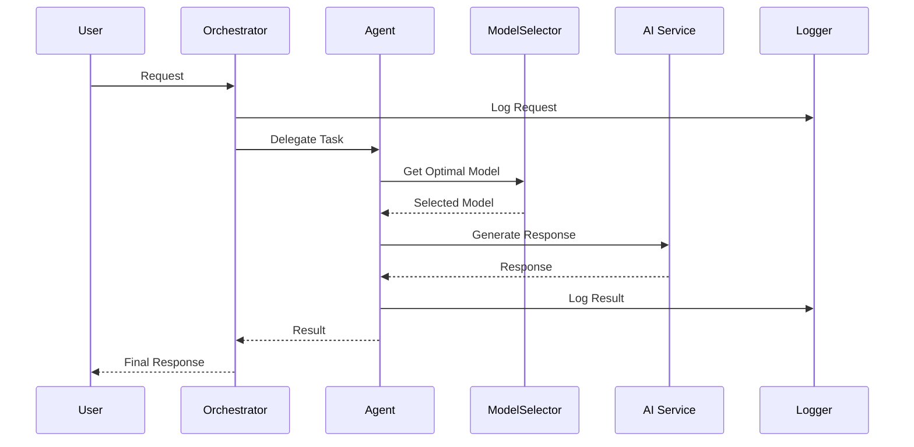
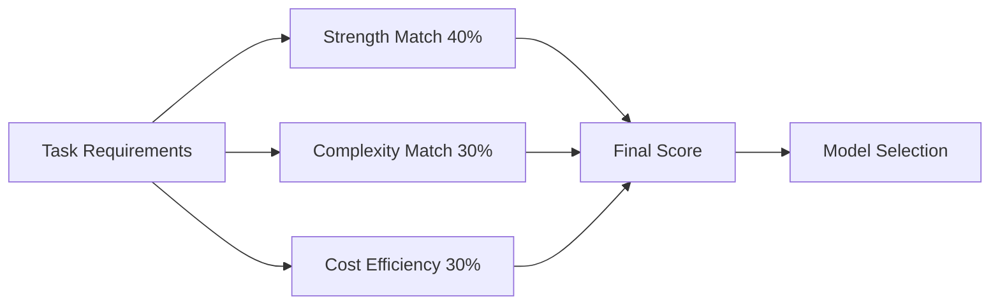
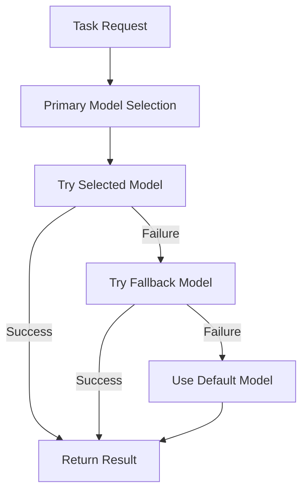
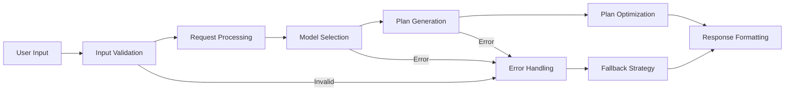
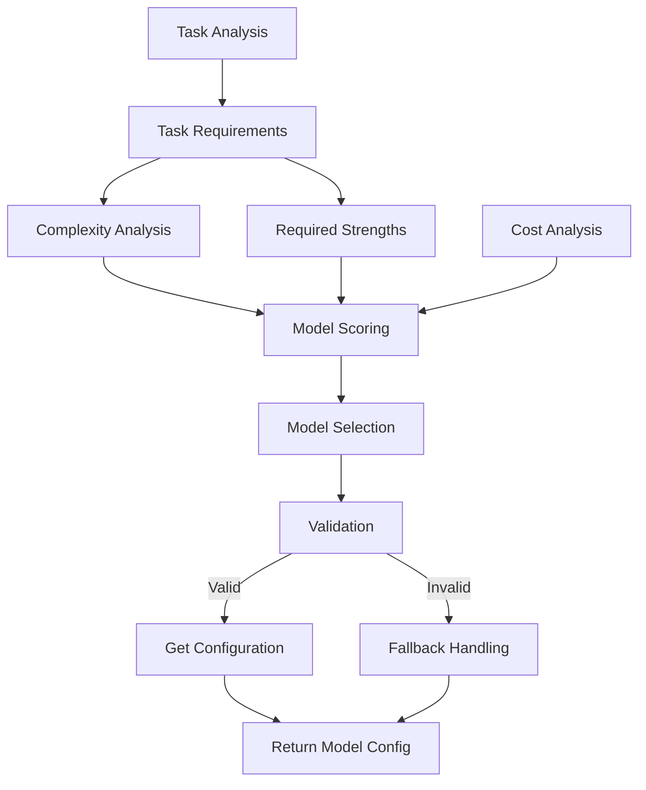
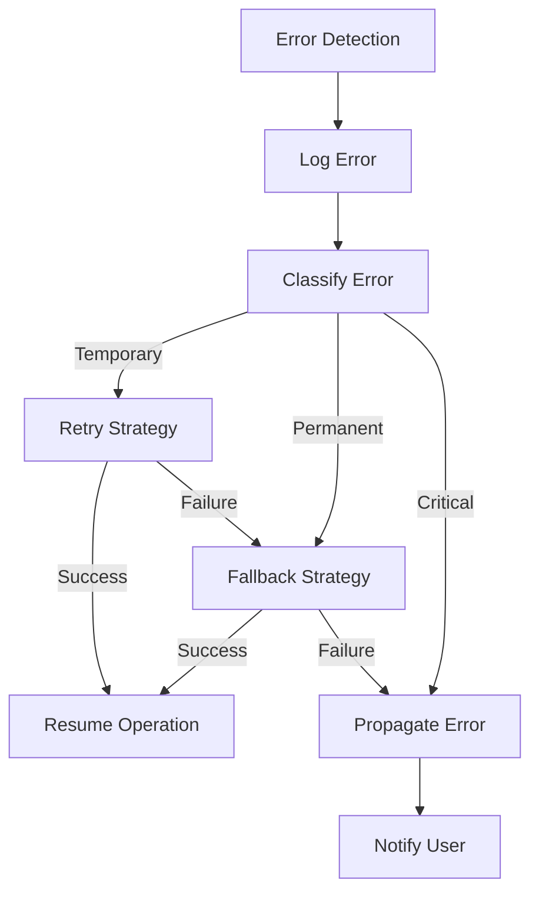

# Trip Planner System Patterns

## Architecture Overview

### 1. Multi-Agent System

### 2. Agent Communication Pattern

## Design Patterns

### 1. Factory Pattern

- AIClientFactory for creating AI service clients
- AgentFactory for instantiating specialized agents
- ModelSelector for creating model configurations
- ProviderFactory for search service providers

### 2. Strategy Pattern

- Interchangeable AI providers
- Flexible planning strategies
- Customizable optimization approaches
- Dynamic model selection strategies
- Multiple search provider options

### 3. Observer Pattern

- Event-driven agent communication
- Status updates and notifications
- Progress tracking
- Model performance monitoring
- Error reporting and logging

### 4. Command Pattern

- Encapsulated agent requests
- Queued task execution
- Operation history
- Model selection history
- Rollback capabilities

### 5. Template Method Pattern

- Base agent implementation
- Standardized message handling
- Common tool integration
- Model selection workflow
- Error handling templates

### 6. Scoring Pattern

### 7. Fallback Pattern

## Component Relationships

### 1. Agent Layer

- BaseA2AAgent as foundation
- Specialized agent implementations
- Inter-agent communication
- Model selection integration
- Error handling standardization
- Logging and monitoring

### 2. Tool Layer

- BaseTool as foundation
- Specialized tool implementations
- Tool registration and management
- Model-specific tools
- Cross-provider compatibility
- Error recovery strategies

### 3. AI Integration Layer

- Abstract AIClient interface
- Concrete provider implementations
- Response handling and formatting
- Model selection orchestration
- Fallback mechanism implementation
- Retry and circuit breaking patterns

### 4. Configuration Layer

- Centralized settings management
- Environment variable loading
- Validation and defaults
- Model configuration centralization
- Provider configuration
- Deployment configuration

## Data Flow Patterns

### 1. Request Flow

### 2. Model Selection Flow

### 3. Error Handling Flow

## Error Handling Patterns

### 1. Error Types

- ValidationError: Input validation errors
- ProcessingError: Task processing failures
- AIServiceError: AI service communication failures
- CommunicationError: Inter-agent communication issues
- ModelSelectionError: Model selection and configuration errors
- ProviderError: Search provider failures
- AuthenticationError: API key and authentication failures

### 2. Recovery Strategies

- Retry mechanisms with exponential backoff
- Fallback options for alternative models
- Graceful degradation of functionality
- Error reporting with detailed context
- Alternative model selection paths
- Circuit breaking for failing services
- Request caching for frequently accessed data

## Optimization Patterns

### 1. Response Optimization

- Cache frequently used data
- Batch similar requests
- Parallel processing
- Resource pooling
- Model performance caching
- Result deduplication
- Progressive enhancement

### 2. Plan Optimization

- Time-based optimization
- Cost-based optimization
- Preference matching
- Constraint satisfaction
- Model selection optimization
- Multi-criteria decision making
- Sequential optimization

### 3. Model Selection Optimization

- Task complexity analysis with multiple factors
- Strength matching using semantic similarity
- Cost efficiency calculation with budget awareness
- Performance history tracking
- Dynamic weight adjustment
- Adaptive selection based on feedback
- Continuous refinement of selection criteria

### 4. Configuration Optimization

- Environment-specific settings
- Dynamic configuration loading
- Default fallback values
- Validation and transformation
- Centralized management
- Configuration caching
- Cross-component consistency
