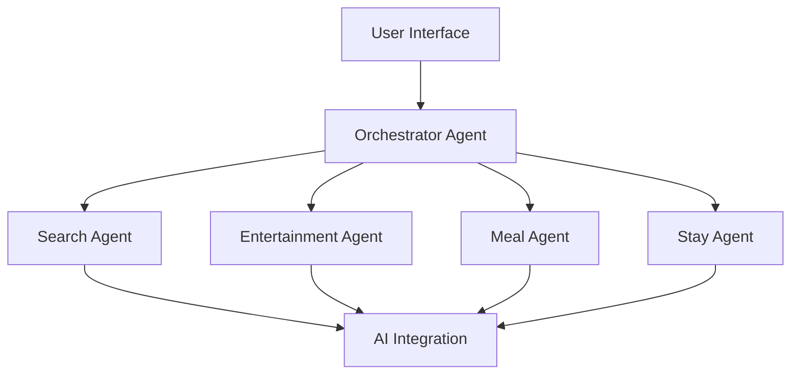
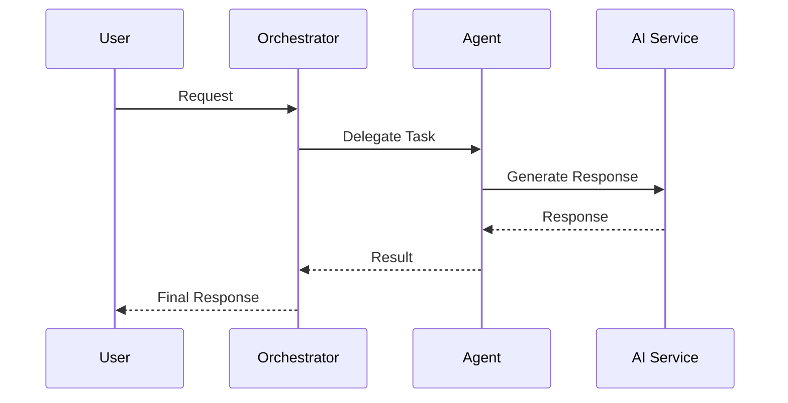
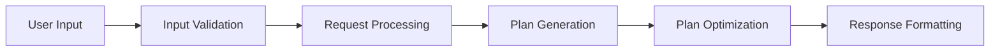
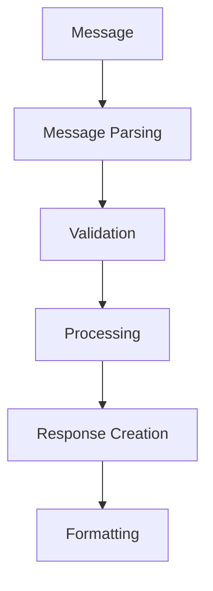

# Trip Planner System Patterns

## Architecture Overview

### 1. Multi-Agent System

### 2. Agent Communication Pattern

## Design Patterns

### 1. Factory Pattern

- AIClientFactory for creating AI service clients
- AgentFactory for instantiating specialized agents

### 2. Strategy Pattern

- Interchangeable AI providers
- Flexible planning strategies
- Customizable optimization approaches

### 3. Observer Pattern

- Event-driven agent communication
- Status updates and notifications
- Progress tracking

### 4. Command Pattern

- Encapsulated agent requests
- Queued task execution
- Operation history

### 5. Template Method Pattern

- Base agent implementation
- Standardized message handling
- Common tool integration

## Component Relationships

### 1. Agent Layer

- BaseA2AAgent as foundation
- Specialized agent implementations
- Inter-agent communication

### 2. Tool Layer

- BaseTool as foundation
- Specialized tool implementations
- Tool registration and management

### 3. AI Integration Layer

- Abstract AIClient interface
- Concrete provider implementations
- Response handling and formatting

## Data Flow Patterns

### 1. Request Flow

### 2. Agent Communication Flow

## Error Handling Patterns

### 1. Error Types

- ValidationError
- ProcessingError
- AIServiceError
- CommunicationError

### 2. Recovery Strategies

- Retry mechanisms
- Fallback options
- Graceful degradation
- Error reporting

## Optimization Patterns

### 1. Response Optimization

- Cache frequently used data
- Batch similar requests
- Parallel processing
- Resource pooling

### 2. Plan Optimization

- Time-based optimization
- Cost-based optimization
- Preference matching
- Constraint satisfaction
